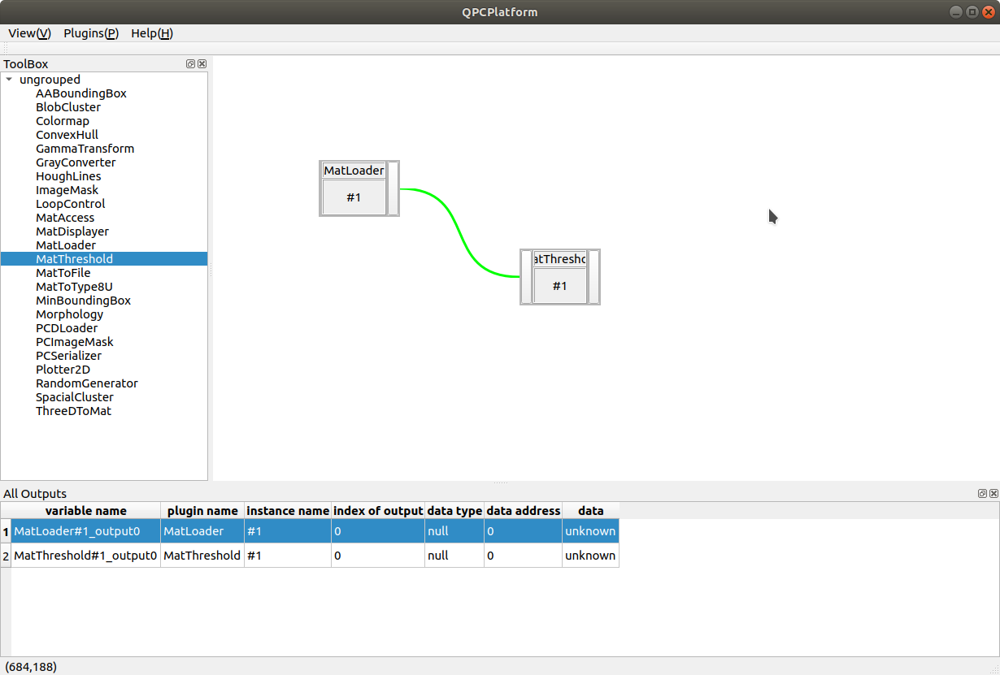

# QPCPlatform

## 介绍

该程序是一个基于Qt的插件库，可以通过拖放插件到画板上组装不同的工作流程。将一个插件输出与其他插件输入连接即可实现数据的流动。主界面大致像下面：



本程序特点：

- 支持插件热插拔
- 提供插件模板生成，便于快速开发
- 类型抹除，数据可在插件之间自动流动

目前界面还不是很美观，功能也未完全开发完......

## 编译

编译使用Qt Creator打开相关的`.pro`文件编译即可，最好是Qt5版本（其他版本未测试）。编译前需要进行一定的配置工作，

准备工作：

- 更改依赖库配置

  所有文件夹下的`.pri`文件均为使用到的某一特定依赖库的配置（如头文件、共享库路径等），需要根据本机该依赖库的相关属性重新配置。一般情况下如果ubuntu上安装了PCL库，OpenCV库，则对应的配置文件与这里提供的应当一致，无需更改。

  如果需要更改，比如本项目使用到PCL库和OpenCV库，更改`PCL.pri`与`OpenCV.pri`中相应包含文件路径以及依赖的共享库；然后执行该文件夹下的`replace_all_config.sh`替换所有用到PCL库与OpenCV库的相应配置。

- 更改主程序相关的`configure`配置

  进入`configure`文件夹下删除`sys.xml`

编译安装：

1. 编译主程序依赖项

   进入`dependency`文件夹下每一个依赖项文件夹下，打开其`.pro`文件，依次编译`Reflex`，`IPlugin`，`QtPCLViewer`以及`TypeDataPeeker`等项目（编译release模式）

2. 编译主程序

   在主目录下，打开`QPCPlatform.pro`编译

3. 编译插件

   进入`Plugins`文件夹（大写开头的），编译其下的每一个插件

   ==一步编译==：在源码目录下执行`./build_all.sh`自动开始全部项目的编译。

4. 安装

   ```cmd
   sudo ./install.sh
   ```
   
   以上默认安装在主目录下`QPCPlatform`目录；或者指定安装路径：
   
   ```cmd
   sudo ./install.sh /opt/QPCPlatform
   ```
   
   

